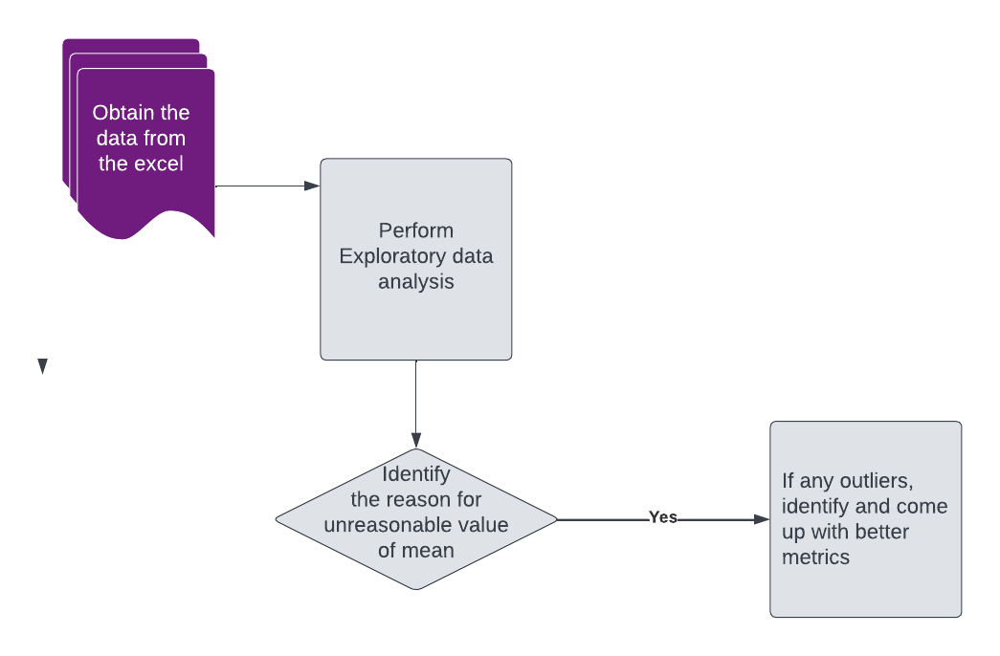
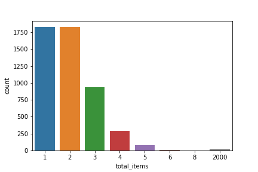
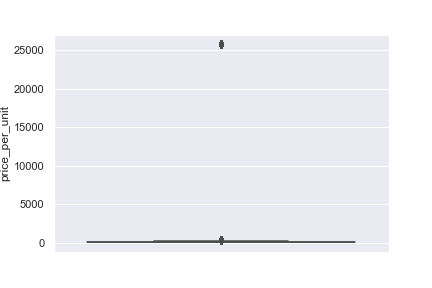

```{r setup, include=FALSE}
# knitr::opts_chunk$set(echo = FALSE)
library(knitr)
library(kableExtra)
library(tidyverse)
```


# Executive Summary

In this project, I aim to use pandas and SQL to unearth the answer for the questions in Shopify Data Challenge 2022. . 
My approaches include data preprocessing methods and data exploratory analysis methods of data provided in the excel sheet.I used python pandas, numpy for data analysis and seaborn and matplotlib for data visualization to understand the trends in the data and arrive at a better metric to calculate the average order value.


# Introduction

Shopify is a leading e-commerce platform for all kinds of  businesses. Shopify aims to understand the reason behind the unreasonable value of mean for all the shoes sold on their platform. Sneakers being a relatively affordable item, an average of $3145.13 calculated seems to be incorrect. There is certainly some discrepency in the data.

The main business objectives are (1) Identify the reasons for a very high mean price of shoes sold on shopify
(2) Identify if there are any potential outliers
(3) Propose a better metrics to evaluate the mean given the existing scenario

Deliverables include a reproducible report with project results, and all documentation and SQL code archived in GitHub repository.  


# Data 

The data for question 1 comes from the excel sheet provided.
The second question was solved online on w3 schools webpage and the answers along with the code has been documented.


# Project pipeline 

```{r project-pipe}
#| echo=FALSE, 
#| out.width = '100%',
#| fig.cap="Project pipeline graphic outlining data science approach that will be taken between May - June 2022. *LDA refers to Latent Allocation model that will be applied to perform topic modelling."

```


# Data Science Approach

This data science project starts with data exploration using pandas and plots. 

## Data Preprocessing

The data provided did not have any null values.It mainly consists of data pertaining to the sales of sneakers, price, quantity, seller details, customer id and payment method involved.

## EDA

A simple EDA was performed on data and following were identified.
Firstly, at present a very naive approach of calculating the mean by taking the average of total cost of all shoes by total quantity is being employed to arrive at the current AOV of $3145.13. This would have been reasonable if the item involved is an expensive electronics or jewelry piece, but for sneakers paying that high amount would not be reasonable.

### Method-1
A better method would have been to calculate the price per unit and obtain the mean of the same. This method would have made sense if there are no potential outliers and we would want to consider all the data points.

```{r count-plot}
#| echo=FALSE, 
#| out.width = '75%',
#| fig.cap="The count plot showing the the total number of items per order is right skewed. Also there are 17 instances where each order contained 2000 items"


```

The method employed would be correct if there were no outliers in the data or if the total_items is normally distributed. But the count plot shows the data is right skewed and there are 17 instances where the order placed contained 2000 items. So calculating the mean of price per unit we arrive at an average order value of $ 387.7428 which does not seem unrealistic.

```{r Method-1, echo=FALSE}
 method_1 <- read_csv("results/method_1.csv") |>
  suppressMessages()
kable(method_1, 
      caption = "Calculate the mean of price per unit") |> kable_styling(font_size = 13) 
```

However, let us proceed with further analysis to find if our method is infact valid.

Let us obtain the statistics of price per unit, order amount and total items

```{r order_amt, echo=FALSE}
 order_amt <- read_csv("results/order_amt.csv") |>
  suppressMessages()
kable(order_amt, 
      caption = "Statistics of Order Amount") |> kable_styling(font_size = 13)
```

```{r price_per_unit, echo=FALSE}
 price_per_unit <- read_csv("results/price_per_unit.csv") |>
  suppressMessages()
kable(price_per_unit, 
      caption = "Statistics of Price Per Unit", 
      align = "ll") |> kable_styling(font_size = 13)
```

```{r total_items, echo=FALSE}
 total_items <- read_csv("results/total_times.csv") |>
  suppressMessages()
kable(total_items, 
      caption = "Statistics of Total Items", 
      align = "ll") |> kable_styling(font_size = 13)
```

As shown in Table \@ref(tab:order_amt), \@ref(tab:price_per_unit), \@ref(tab:total_items) , the mean of price per unit is $387 but the maximum value is $25725. Similarly the mean of order amount is $ 284 but the maximum amount is $704000. The mean of total items is 2 but the maximum is 2000. There are certainly some discrepencies in the data. 

Further investigation shows that, there are 46 orders where each pair of shoes costs $ 25725 corresponding to shop with shop id 42 and 17 instances with 2000 items in each order corresponding to the shop with shop id 78. We should focus on these two cases to arrive at a solid conclusion.

```{r grouped, echo=FALSE}
 grouped <- read_csv("results/grouped.csv") |>
  suppressMessages()
kable(method_1, 
      caption = "Calculate the mean of price per unit", 
      align = "ll") |> kable_styling(font_size = 13)
```


```{r box-chart}
#| echo=FALSE, 
#| out.width = '75%',
#| fig.cap="Bar chart indicating the top 15 frequent terms in Biomechanics-related scientific corpora. The x-axis indicates the most common words and y-axis indicates the frequency of these words in the corpora."

```

They might be selling exclusively premium quality shoes.The box plot (see Figure \@ref(fig:box-chart)) shows the distribution of the price per unita dn confirms the presence of outlier.
Also, The bar chart above (see Figure \@ref(fig:count-plot)) shows the distribution of total items in each order. We can detect presence of a particular case where each order has 2000 items as mentioned earlier.

There may be many reasons for this discrepency in the data. 
The shop might be selling exclusively personalized shoes at a very high premium price or there might have been some mistake in data collection leading to an error.
These are definitely cases that shopify has to shift its focus to

## Metric Evaluation

Since the presence of the outliers has been detected, we can treat them by removing them and calculating the mean of the rest of the items or instead use other metric like median which is less influenced by extreme values.

## Method-2
### Remove the outliers and calculate

```{r final_csv, echo=FALSE}
final_csv <- read_csv("results/final.csv") |>
  suppressMessages()
kable(method_1, 
      caption = "Calculate the mean of price per unit", 
      align = "ll") |> kable_styling(font_size = 13)
```
 
 Removing the outliers and calculating the mean would give us a mean of $ 302 which seem more reasonable given the situation

## Method-3
### Median Approach 

In the presence of outliers, a better method to calculate the central tendency of the data would be median. This is because median is less susceptible to be influenced by the presence of outliers. Hence, it is reasonable to consider the median instead of mean of order value to obtain the average order value.

## Project challenges and Limitations

The fact that the methods involved in collecting the data made it difficult to decide on the cause of the presence of outliers.Hence proper methods to treat the outliers could not be employed.

# Conclusion 

During the course of this project, we will be applying these data science approaches while being
mindful of the limitations as stated above. Project updates will be communicated during scheduled meetings with the 
project partner for further clarification and improvements. 
